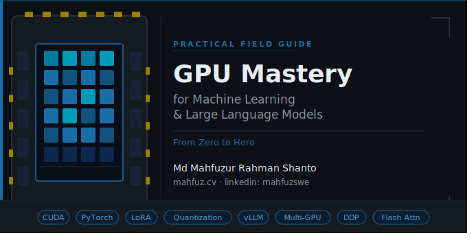

# Practical GPU Mastery for Machine Learning and LLMs
### From Zero to Hero

**Author:** Md Mahfuzur Rahman Shanto  
**Portfolio:** [mahfuz.cv](https://mahfuz.cv) · **LinkedIn:** [linkedin.com/in/mahfuzswe](https://linkedin.com/in/mahfuzswe)

---

---

> A practical field guide for students, researchers, and early-stage ML engineers. Every chapter helps you *do* something, *fix* something, or *optimize* something. No filler.

---

## Who This Is For

- Beginners who have never run code on a GPU
- ML practitioners moving from CPU-only workflows to GPU training
- Researchers working with deep learning models or LLMs who want to squeeze more out of their hardware

---

## How to Use This Guide

Read it front to back if you are starting from zero. Jump to specific chapters if you already have a foundation and need to fill in gaps. The chapters are ordered by dependency — each one builds on the concepts from the previous.

---

## Table of Contents

| Chapter | Title | What You Learn |
|---|---|---|
| [01](chapters/chapter-01-foundations.md) | **Foundations** | GPU vs CPU, CUDA, VRAM, Tensor Cores, ecosystem overview |
| [02](chapters/chapter-02-environment-setup.md) | **Environment Setup** | CUDA install, PyTorch + TF GPU setup, verification, common failures |
| [03](chapters/chapter-03-first-gpu-usage.md) | **First Practical GPU Usage** | Device placement, training loop, nvidia-smi, debugging |
| [04](chapters/chapter-04-performance-optimization.md) | **Performance Optimization** | Mixed precision, batch tuning, DataLoader, gradient accumulation, profiling |
| [05](chapters/chapter-05-deep-learning-workloads.md) | **Deep Learning Workloads** | CNN workflow, Transformers, large datasets, multi-GPU (DDP) |
| [06](chapters/chapter-06-llm-era.md) | **GPU in the LLM Era** | VRAM math, quantization, LoRA/PEFT fine-tuning, inference optimization |
| [07](chapters/chapter-07-cloud-and-remote-gpu.md) | **Cloud & Remote GPU** | Colab, Kaggle, paid services, SSH + remote workflows |
| [08](chapters/chapter-08-real-world-engineering.md) | **Real-World Engineering** | Choosing hardware, cost trade-offs, CUDA errors decoded, common mistakes |
| [09](chapters/chapter-09-zero-to-hero-roadmap.md) | **Zero to Hero Roadmap** | Week-by-week learning path, recommended stack, mini-projects |
| [10](chapters/chapter-10-appendix.md) | **Appendix** | Command cheat sheet, error reference table, curated resources |

---

## Quick Start

If you are completely new, read **Chapter 1** first to build the mental model, then **Chapter 2** to get your environment working. From there, **Chapter 3** gives you your first real GPU code to run and observe.

If you already have PyTorch working on GPU, jump directly to **Chapter 4** for optimization techniques that apply to almost every training job.

If you are specifically working with LLMs (fine-tuning, inference, quantization), **Chapter 6** is the most relevant.

---

## Start Learning

### **[🚀 Start Now →](chapters/chapter-01-foundations.md)**

*Begin with Chapter 1: Foundations. Every chapter builds on the previous, so starting from the beginning is recommended.*

---

## Code Examples

All code examples in this guide are:
- Written for **PyTorch** (primary) and occasionally Hugging Face Transformers
- Tested on CUDA 12.x with PyTorch 2.x
- Self-contained — each snippet runs independently with minimal setup
- Commented to explain the reasoning, not just the syntax

---

## License

This guide is freely available for personal learning and educational use.

---

*If this guide helps you, consider sharing it with someone else who is learning GPU programming.*
